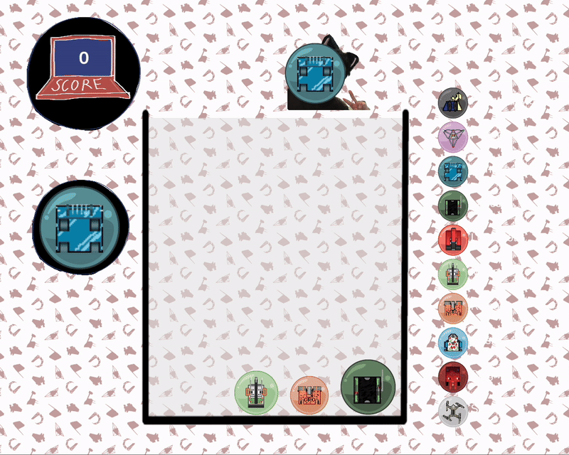

# CRSuika-Game
Created by: Caedy Lee, Sophie Cheng and Chris Adonizio for Combat Robotics @ Cornell

## Summary
A 2D fruit-combiner game, created in Unity, inspired by the popular "[Suika Game](https://suikagame.com/)", customized to fit the theme of Combat Robotics @ Cornell. 
Players combine robots to create new robots, with trackers for both the score and the next robot about to be dropped.
- Reference: [Suika Tutorial](https://www.youtube.com/watch?v=liDKiD6yv8E&ab_channel=SasquatchBStudios)

## Gameplay

- Objective: Combine different fruits to create larger fruits and maximize your score.
- Controls:
    1. Arrow Keys/WASD: Move player across the screen.
    2. Spacebar: Drop a robot into the game area.
- Game over functionality: automatic resetting

## Improvements
- Specialized functionality when combining specified robots (e.g. area damage)
- Re-order of the evolution of robots to reflect when they were made
